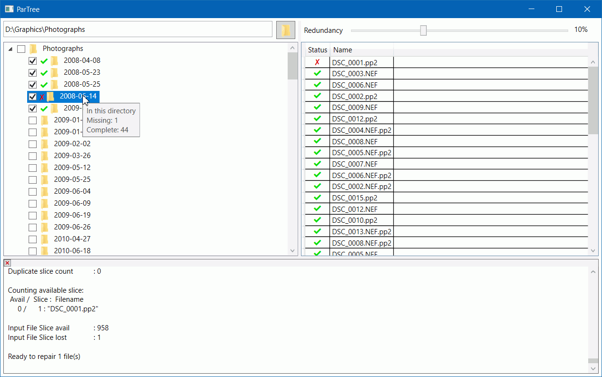

# ParTree

[ParTree](https://mrevil.asvachin.com/software/partree/) is a tool for creating [PAR2](https://en.wikipedia.org/wiki/Parchive) recovery files for detecting and correcting errors in stored data. While other such tools exist, they are all intended to create recovery files to protect a fixed set of data, with the data and its recovery files stored together. ParTree is designed to create recovery files for multiple independent sets of data quickly, and stores the recovery files separately.

The intended use is to protect backup drives from corruption. Since backup drives typically have data added to them regularly, it's not practical to create a single set of recovery files for the whole drive at once, as they would need to be recreated every time the data changed. ParTree makes it easier to create recovery files for only the new or changed data. As ParTree stores the recovery files in a separate directory, they aren't mixed up with the actual data, making restoring from the backup easier.

ParTree uses par2j, which is part of [Multipar](http://hp.vector.co.jp/authors/VA021385/), to do all the hard work of creating recovery files etc.

## Requirements

* .NET 5.0 or later https://dotnet.microsoft.com/download/dotnet/current/runtime
* Any version of Windows that can run .NET 5.0 (Windows 7, 8, 8.1, 10).

## Installation

Extract the zip file somewhere. ParTree is self-contained, keeping its config in its own folder, so it can be installed anywhere, and multiple installations can co-exist.

## Uninstallation

Delete the files that were extracted from the zip. You may also wish to delete the directories that ParTree stored recovery files in. These are named _.ParTree_ and flagged as hidden.

## Usage

* Run ParTree.exe.
* Click the _Select working directory_ button at the top of the window.
* Select the directory that you want to manage, which will be where ParTree stores recovery files. Typically this will be an external drive, or other location intended for long-term storage.
* Everything in that directory will now be shown in the panel on the left. If a directory is selected, its files will be shown in the panel on the right.

### Adding recovery files
* Optionally change the amount of redundancy with the slider at the top of the window. More redundancy allows recovery from more errors, but takes more space.
* Check the checkboxes next to any directories you want to protect.
* ParTree will automatically create recovery files as directories are checked. Creating recovery files may take some time, depending on the amount of data and the speed of the storage device.
* You can check as many directories as you want, and each will have its own separate recovery files created.

### Deleting recovery files
* Uncheck the checkbox next to a directory and the recovery files will automatically be deleted.

### Checking for corrupt or missing files
* Right-click on a directory and then click on _Verify_.
* Verification can take a while if there is a lot of data or the storage device is slow.
* Once complete, a ✔ symbol will be displayed next to the directory if no files in that directory and its subdirectories were found to be corrupt or missing. A ✘ symbol will be shown if any files are missing or corrupt.

### Repairing corrupt or missing files
* Right click on a directory and then click on _Repair_.
* All files that can be repaired will be.
* Check the output log at the bottom to see details if any files could not be repaired.

## Limitations

* ParTree can't detect if a checked directory has been moved, and will show it as missing instead. It is possible to manually move the corresponding files in the _.ParTree_ directory if you want to avoid having to recreate them.
* Once a working directory has been selected, changes to its contents will not be detected while ParTree is running. If necessary, selecting the same working directory again will refresh it.
